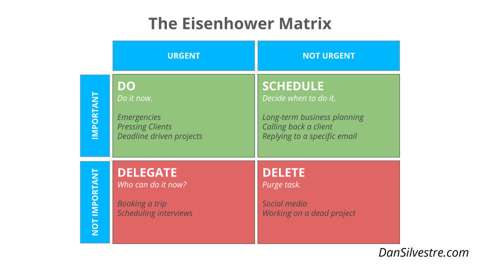

# Time Management Concepts

* Pomodoro Technique
* 1-3-5 Method
* Eisenhower Matrix
* 10–10–10: A Life-Transforming Idea
* Track Your Time
* 2-Minute Rule

# Pomodoro Technique
https://www.youtube.com/watch?time_continue=70&v=VFW3Ld7JO0w

# 1-3-5 Method
Choose 1 big thing, 3 medium things, and 5 small things to accomplish, checking them off as you complete them.

# Eisenhower Matrix

# 10–10–10: A Life-Transforming Idea
Suzy Welch introduces a simple decision-making system. When you have a decision to make, ask yourself the following three questions:

How will I feel about this decision 10 minutes from now?
How will I feel about it 10 months from now?
And in 10 years from now?

# Track Your Time
Most of us can guess, but our estimates are normally way off. A time-tracking app can help you take out the guesswork and provide real data on your productivity.

## 2-Minute Rule
If it can be done in two minutes, just do it.
> Don’t add it to your to-do list, put it aside for later, or delegate to someone else. Just do it.

# References

* http://www.dansilvestre.com/time-management-techniques/